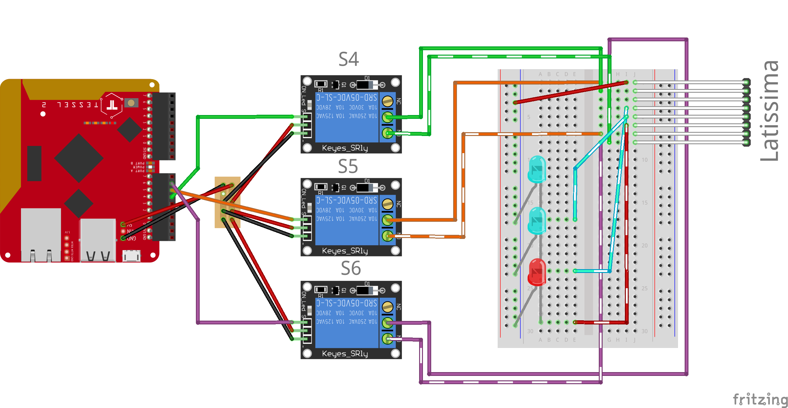

# HTCPCP DeLonghi Latissima Hack
### Hyper Text Coffee Pot Control Protocol DeLonghi Hack

This is a hack of a DeLonghi Latissima to be internet-enabled. It uses a subset of the [Hyper Text Coffee Pot Control Protocol](https://www.ietf.org/rfc/rfc2324.txt) to control it. 

[If you want to know more how this works you can check out this blog post](https://moin.world/2017/04/01/how-we-hacked-our-coffee-machine-with-javascript/)

## Setup

You need:
- A DeLonghi Latissima
- A Tessel 2
- Jumper Wires
- A breadboard
- 3 relays
- 3 LEDs

## Contributors

- Dominik Kundel <<dominik.kundel@gmail.com>>

## License

MIT
